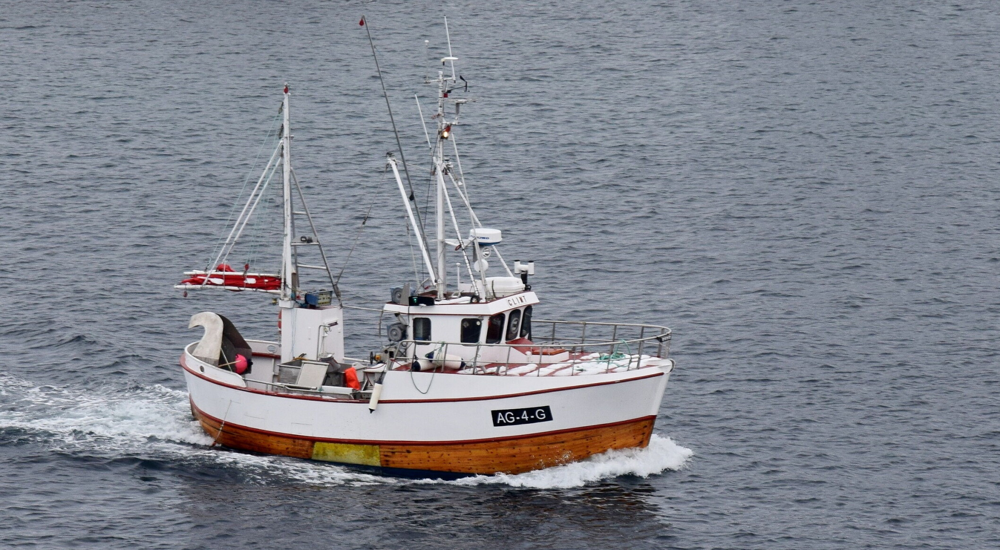

# SjarkSimulator

I got curious about what people use for boat simulators in hobby robotics, but then I realized Gazebo and Isaac Sim are
kind of the jack of all trades and master of none. Great tools, but also GPU hungry (which I dont have money for).

I mostly care about the math and dynamics, so I built my own fast easy-to-understand 6 DOF boat model with quaternions and a Fossen style marine
dynamics formulation. It includes approximations for hydrodynamic damping, Coriolis forces, gravity and buoyancy, and full attitude dynamics in yaw, pitch, and roll. It is a nice middle ground between “toy model” and “too much”. So make sure the time integration was stable in the spherical manifold, I also added exponential integrators to ensure stability and accuracy.

To test the simulator I also added a basic Line-Of-Sight control system, which follows a custom made B Spline path.

While this is a side project, it is still a quite ambitious hobby project, so I use Codex to write all the tests and harder debugging so I can focus on the fun parts (which is the mathematics and physics)! 

# Sjark
Just to have a reference, I will use a basic small wooden fishing boat from the 1970s (also called Sjark in Norwegian).

After searching a bit around these are typical specifications:

### Known specs
- Length overall: 10 m
- Beam: 4 m
- Hull depth: 5m
- Mass with full cargo, estimate: 16.5 ton
- Reported operating speed: 7 kn
- Propulsion note: basic rotating propellar

### Dynamical model
The vessel dynamics are modeled using a full 6 DOF rigid body formulation following
Thor I. Fossen’s marine craft modeling framework.

The equations of motion are written as 

`M * nu_dot + C(nu) * nu + D(nu) * nu + g(eta) = tau + tau_env`

where each term has a clear physical interpretation:

- `M` is the total inertia matrix, consisting of rigid body inertia and added mass.
  It captures resistance to linear and angular acceleration.

- `C(nu)` is the Coriolis and centripetal matrix associated with `M`.
  It represents velocity dependent coupling between translational and rotational motion.

- `D(nu)` is the hydrodynamic damping matrix.
  It models energy dissipation due to viscous drag, wave making, and flow separation.

- `g(eta)` is the vector of restoring forces and moments.
  It accounts for gravity and buoyancy and provides static stability in heave, roll, and pitch.

- `tau` is the control input vector.
  It represents forces and moments generated by propulsion and steering actuators.

- `tau_env` represents external environmental loads.
  Typical contributions are wind, current, and wave induced forces.

The generalized velocity vector is

`nu = [u v w p q r]^T `

where `u, v, w` are body fixed linear velocities and `p, q, r` are body fixed angular rates.

The generalized position and attitude vector is

`eta = [x y z phi theta psi]^T `

where `x, y, z` define position in the inertial frame and `phi, theta, psi` define roll,
pitch, and yaw.
